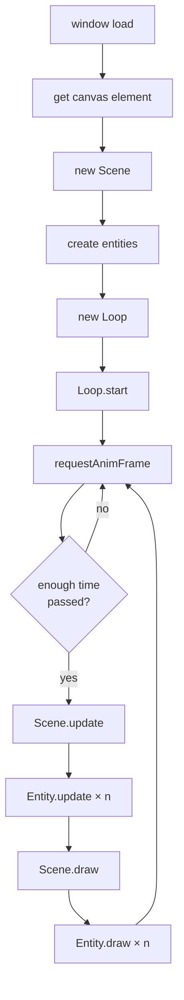

# canvas-template

A starting point for canvas animation projects. Clone it, open `canvas.html` in a browser, and start tweaking — no build tools needed.

## Getting started

1. Clone this repo.
2. Open `canvas.html` in a browser.
3. Edit `js/sketch.js` and go from there.

## How it works

## Projects using this template

- [canvas-fireworks](https://github.com/lukecassidy/canvas-fireworks)
- [canvas-digital-rain](https://github.com/lukecassidy/canvas-digital-rain)
