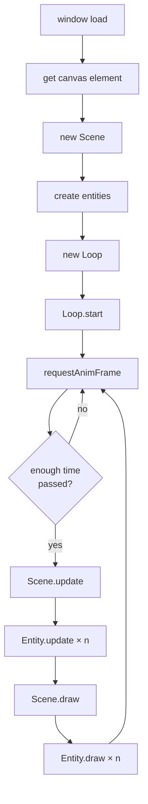

# canvas-boilerplate

A starting point for canvas animation projects. Clone it, open `canvas.html` in a browser, and start tweaking — no build tools needed.

## Getting started

1. Clone this repo.
2. Open `canvas.html` in a browser.
3. Edit `js/sketch.js` and go from there.

## How it works

## Customisation

| What to change      | Where                                                              |
| ------------------- | ------------------------------------------------------------------ |
| Canvas size         | `canvas.html` — `width` / `height` on the `<canvas>` element       |
| Update rate         | `CONFIG.TIME_STEP` — milliseconds between updates (lower = faster) |
| Entity count        | `CONFIG.PARTICLE_COUNT`                                            |
| Entity size / speed | `CONFIG.PARTICLE`                                                  |
| Trail fade speed    | `CONFIG.COLOURS.BACKGROUND` alpha — lower = longer trails          |
| Entity behaviour    | `Particle` class — `update()` and `draw()`                         |
| Scene behaviour     | `Scene` class — spawning, removal, inter-entity logic              |

## Class reference

| Class      | Responsibility                                                                                                              |
| ---------- | --------------------------------------------------------------------------------------------------------------------------- |
| `Particle` | A single animated element. Rename this to suit your effect (e.g. `Firework`, `RainStream`).                                 |
| `Scene`    | Owns all the entities — creates, updates, and draws them each frame. Rename it too (e.g. `FireworksScene`).                 |
| `Loop`     | Fixed-timestep animation loop. You shouldn't need to touch this — just pass it a `Scene` with `update()` and `draw()`.     |
| `Helper`   | Static utility methods (`random`, `getRandomColour`). Chuck any pure helpers in here.                                       |

## Projects using this boilerplate

- [canvas-fireworks](https://github.com/lukecassidy/canvas-fireworks)
- [canvas-digital-rain](https://github.com/lukecassidy/canvas-digital-rain)
